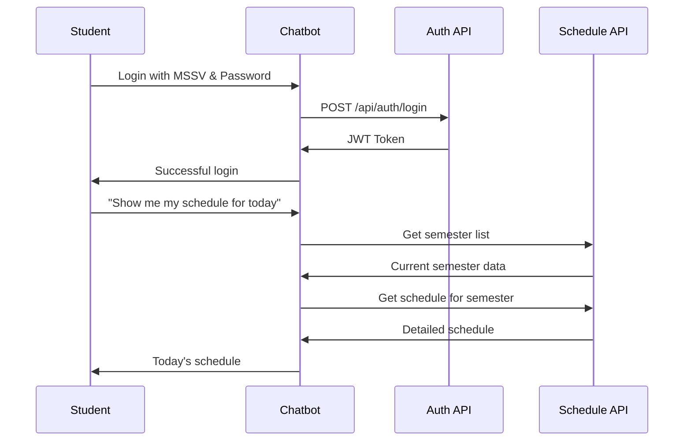

# PTIT University API Integration Plan

## 1. API Endpoints Overview

| Purpose           | Endpoint                                                         | Method | Authentication      |
| ----------------- | ---------------------------------------------------------------- | ------ | ------------------- |
| Authentication    | `https://uis.ptithcm.edu.vn/api/auth/login`                      | POST   | No (provides token) |
| Get Semester List | `https://uis.ptithcm.edu.vn/api/sch/w-locdshockytkbuser`         | POST   | Bearer Token        |
| Get Schedule      | `https://uis.ptithcm.edu.vn/api/sch/w-locdstkbtuanusertheohocky` | POST   | Bearer Token        |

## 2. Authentication Flow



## 3. Implementation Steps

### 3.1 Authentication Service

Create a service to handle authentication and token management:

```python
class PTITAuthService:
    def __init__(self):
        self.base_url = "https://uis.ptithcm.edu.vn/api"
        self.token = None
        self.token_expiry = None

    async def login(self, username, password):
        # POST request to /auth/login
        # Store token and expiry
        # Return success/failure

    async def refresh_token_if_needed(self):
        # Check if token is expired
        # Refresh if needed

    async def get_auth_headers(self):
        # Return headers with token for API requests
```

### 3.2 Schedule Service

Create a service for retrieving schedule information:

```python
class PTITScheduleService:
    def __init__(self, auth_service):
        self.base_url = "https://uis.ptithcm.edu.vn/api"
        self.auth_service = auth_service

    async def get_current_semester(self):
        # Call /sch/w-locdshockytkbuser
        # Find semester that includes current date
        # Return semester ID

    async def get_schedule_for_date(self, date):
        # Get current semester
        # Call /sch/w-locdstkbtuanusertheohocky with semester
        # Find classes for specified date
        # Return formatted schedule
```

## 4. Data Processing

### 4.1 Date Processing

We need to match between our extracted date from user queries and the date format in API responses:

1. User date extraction gives us a Python `date` object
2. API response has dates in format "DD/MM/YYYY" or ISO format "YYYY-MM-DDT00:00:00"
3. Need conversion functions in both directions

### 4.2 Schedule Data Format

After retrieving schedule data, we'll format it as:

```python
{
    "date": "2024-12-30",
    "day_of_week": "Monday",
    "classes": [
        {
            "subject_code": "INT1341_CLC",
            "subject_name": "Nhập môn trí tuệ nhân tạo",
            "time_start": "07:30",
            "time_end": "11:00",
            "room": "1A206-Quan 1",
            "lecturer": "Unknown",
            "class_group": "E22CQCN02-N"
        },
        # Other classes for this day
    ]
}
```

## 5. Integration with Existing Code

### 5.1 Replace Mock API Functions

Update the `mock_get_schedule_from_api` function to use real API:

```python
async def get_schedule_from_api(student_id, date, auth_token):
    auth_service = get_auth_service(student_id, auth_token)
    schedule_service = PTITScheduleService(auth_service)

    return await schedule_service.get_schedule_for_date(date)
```

### 5.2 Add Credential Management

1. Create a secure credential storage system
2. Update the authentication flow to use stored credentials
3. Implement token refresh and error handling

## 6. Security Considerations

1. **Credential Handling**:

   - Never store plaintext passwords
   - Consider integrating with OS keychain
   - Use session-only storage for tokens

2. **Request Security**:

   - Validate all responses
   - Implement proper error handling
   - Set timeouts for all API calls
   - Use HTTPS for all connections

3. **User Privacy**:
   - Only fetch data when explicitly requested
   - Clear sensitive data from memory when not needed
   - Get explicit consent for storing credentials

## 7. Testing Strategy

1. **Unit Tests**:

   - Test date conversion functions
   - Test schedule formatting

2. **Integration Tests**:

   - Mock API responses for testing
   - Test error conditions and recovery

3. **End-to-End Tests**:
   - Manual testing with real credentials (securely)
   - Verify correct schedule retrieval and display

## 8. Implementation Timeline

1. **Day 1-2**: Create authentication service
2. **Day 3-4**: Implement semester detection and schedule retrieval
3. **Day 5**: Replace mock API with real API integration
4. **Day 6-7**: Testing and debugging
5. **Day 8**: Documentation and finalization
